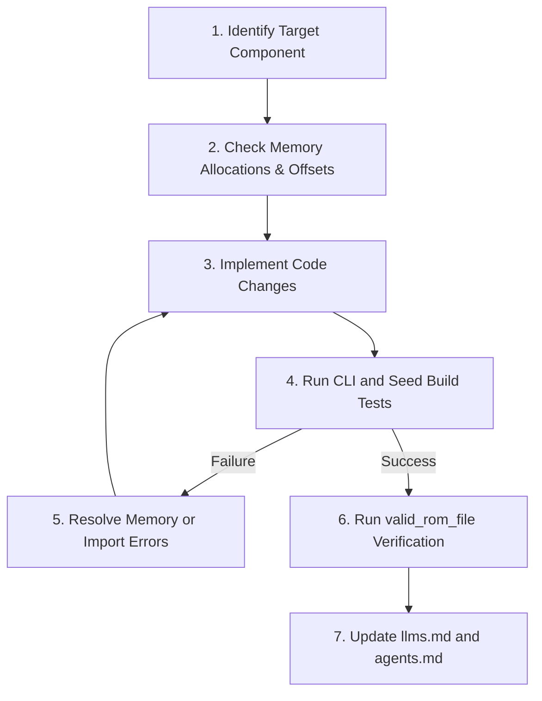

# Operational Playbook for Autonomous AI Agents

This document is written for autonomous AI coding agents (such as Antigravity, SWE-agent, etc.) that have system shell access, terminal execution tools, and the capability to make file edits. It details exact execution procedures, testing environments, diagnostic troubleshooting, and code modification guardrails.

> [!IMPORTANT]
> **SELF-UPDATE MANDATE**: If any changes you make to the codebase during your work affect existing patterns, add new modules, change core APIs, or introduce new paradigms, you **MUST** update this file (`agents.md`) and `llms.md` as part of your changes to keep future AI agents correctly instructed.

---

## 1. Prerequisites & Execution Environment

### 1.1 Python Dependencies
The randomizer runs entirely on Python 3 with the standard library. No external pip installations are required.

### 1.2 Target ROM File
To verify ROM modifications and successfully run a seed generation test, a valid Super Nintendo FF6 ROM file is required:
- **Filename**: ff3.smc (located in the workspace root).
- **Format**: Unheadered, 3,145,728 bytes (3MB).
- **Verify ROM Validity**: You can check the ROM's validity by running:
  ```powershell
  python3 -c "import valid_rom_file; print(valid_rom_file.valid_rom_file('ff3.smc'))"
  ```
  It should output `True`.

### 1.3 Test Data Isolation
> [!IMPORTANT]
> **TEST DATA DIRECTORY RULE**: All test output data (including modified test ROMs, debug log text files, or API metadata manifests generated during your test runs) **MUST** be isolated and placed inside a `tests` directory in the workspace root (e.g., `tests/test_output.smc`, `tests/test_output.txt`).
> - Do not write test output files directly to the root directory.
> - Ensure the `tests` directory is created before running commands (e.g. `mkdir -Force tests`).

---

## 2. Playbook Commands

### 2.1 Basic Verification
To test if the options interface parses arguments successfully without crashes:
```powershell
python3 wc.py -h
```

### 2.2 Seed Generation Verification
To run a complete randomizer build, executing all event scripting, memory parsing, and ROM compilations:
```powershell
# Ensure the tests folder exists
mkdir -Force tests

# Run seed build outputting directly to the isolated tests folder
python3 wc.py -i ff3.smc -o tests/test_output.smc
```
This generates the seed ROM and its log inside the `tests` directory.

### 2.3 Debug Seeding with Logs
To print full section reports (event rewards, character scaling, and shops mapping) to standard stdout:
```powershell
python3 wc.py -i ff3.smc -o tests/test_output.smc -debug -slog
```

---

## 3. Diagnostic & Troubleshooting Guide

During development, agents commonly trigger three specific errors. Here is how to diagnose and resolve them:

### 3.1 Memory Overflow / Bank Exhaustion
**Error Signature**:
```text
MemoryError: Not enough room in space "custom event toggle": Next (0xc0f124) > End (0xc0f100). Diff: 36
```
**Cause**: You have written more bytes of assembly instructions or static data than the target `Reserve` range fits, or have exceeded the size of a dynamically requested `Allocate` block in that bank.
**Resolution**:
1. Check the size parameters in your dynamic allocation: `Allocate(Bank.C0, size, "description")`. Increase `size` to support your assembly array length.
2. If using a `Reserve` block, you are locked to vanilla game boundaries. You must rewrite your routine to be more byte-efficient (e.g., using shared subroutines with `JSR`/`JSL` or tighter register usage).
3. Alternatively, place the bulk of your custom assembly payload inside a dynamic `Allocate` space in Bank `C0`, `C2`, or `F0`, and use the `Reserve` block only to write a `JMP` or `JSR` redirecting to your dynamically allocated address.

### 3.2 Dynamic Import / Startup Crash
**Error Signature**:
```text
AttributeError: module 'args' has no attribute 'my_new_flag'
```
**Cause**: The subsystem list inside [arguments.py](args/arguments.py) does not contain your new module, or a circular dependency was introduced.
**Resolution**:
1. Verify that your custom CLI option module is registered in `self.groups` inside the constructor of `Arguments` in [arguments.py](args/arguments.py#L4-L13).
2. Look at import structures. Ensure you did not import game subsystems globally at the top of your custom script file. Move imports inside functions (e.g. inside `mod()`) to resolve circular bindings.

### 3.3 Event Bit Validation Assertion
**Error Signature**:
```text
AssertionError: Number of char/esper only checks changed - Check usages of CHARACTER_ESPER_ONLY_REWARDS...
```
**Cause**: You modified the number of rewards in an event, causing the randomizer's gating logic to detect that the total available rewards no longer match the hardcoded pool sizes.
**Resolution**:
- If you deliberately added/removed a character/esper check to a quest event (e.g. `phoenix_cave.py`), you must update the global expected total `CHARACTER_ESPER_ONLY_REWARDS` constant in [constants/objectives/results.py](constants/objectives/results.py) (or related metadata files) so that the count validator passes.

---

## 4. Step-by-Step Code Modification Protocol

When tasked with implementing a new feature or fixing a bug, execute this cycle:



1. **Locate Target Files**: Pinpoint if you need to modify options (`args/`), data modeling (`data/`), events (`event/`), or CPU logic (`bug_fixes/`, `battle/`).
2. **Review Offsets**: If doing assembly modifications, examine target ROM offsets to confirm no existing dynamic spaces overlap.
3. **Write Pythonic Logic**: Use standard code paradigms. Implement localized dynamic imports to keep module initialization clean.
4. **Compile & Generate**: Execute `python3 wc.py -i ff3.smc` to verify that standard seed compilation compiles cleanly.
5. **Verify Outputs**: Use `valid_rom_file` verification logic to ensure ROM consistency where applicable.
6. **Update Instruction Files**: Update both `llms.md` and `agents.md` immediately if any changes affect the structure or expectations documented inside these manuals.

---

## 5. Python 3.14 Set Sampling Guardrails

**Error Signature**:
```text
TypeError: Population must be a sequence. For dicts or sets, use sorted(d).
```
**Cause**: Passing a `set` directly to `random.sample()` was deprecated in Python 3.9 and results in a fatal `TypeError` in newer Python versions (such as Python 3.11 through Python 3.14).
**Resolution**:
- Convert the set to a tuple before using random selection:
  ```diff
  - rand_item = random.sample(self.available_items, 1)[0]
  + rand_item = random.sample(tuple(self.available_items), 1)[0]
  ```
- Converting the set to a tuple satisfies Python's sequence checks while maintaining 100% identical random state generation and choice behavior as the vanilla randomizer, preserving full seed compatibility.

---

## 6. Gating deadlocks (AssertionError) in choose_reward

**Error Signature**:
```text
  File "event_reward.py", line 51, in choose_reward
    assert(item_possible)
AssertionError
```
**Cause**: The method `single_possible_type(self)` in `event/event_reward.py` returned `True` for compound flag values like `RewardType.CHARACTER | RewardType.ESPER` because `in RewardType` evaluated to `True` for valid flag combinations in Python's enum implementation. This caused these slots to be processed prematurely during `choose_single_possible_type_rewards` when no characters or espers were left, triggering gating deadlocks.
**Resolution**:
- Explicitly check against the exact single-member flags:
  ```python
  def single_possible_type(self):
      return self.possible_types in (RewardType.CHARACTER, RewardType.ESPER, RewardType.ITEM)

---

## 7. Assembly Hooks and CPU Register Preservation

**Error Signature**: Monster sprites appear as garbled noise blocks, or regular enemies have incorrect sprites.
**Cause**: Modifying registers (such as `X` or `Y`) or using incorrect data bank instruction opcodes inside custom assembly subroutines. Specifically:
1. Destructively overwriting `X` inside a hook when the caller context relies on `X` containing the original graphics index.
2. Using 16-bit absolute address instructions like `LDA absolute,X` (`0xBD`) to access 24-bit dynamic ROM banks (`F0`), which reads from the incorrect data bank and treats the third address byte as the opcode of the next instruction, shifting the entire instruction stream.
3. Looking up active monster IDs from the wrong table or using the wrong index, leading to missing or un-rendered sprite overlays in multi-boss battles.
**Resolution**:
- Always preserve and restore modified registers using `PHX`/`PLX` or `PHY`/`PLY` at the boundaries of your subroutine.
- Use 24-bit long addressing opcodes (`0xAF` for `LDA long`, `0xBF` for `LDA long,X`) when referencing addresses dynamically allocated to Bank `F0`.
- Always load active monster IDs directly from the active monster ID table WRAM `$2001,X` (where `X` is `slot_index * 2`) after clearing the 16-bit Accumulator (using `TDC` `0x7B`) to avoid index register pollution. WRAM `$812F,X` is used by the graphics loader to hold the overwritten graphics ID (e.g. setting it to 0 to trigger Imp graphics), and does not hold the actual active monster IDs for lookup.
